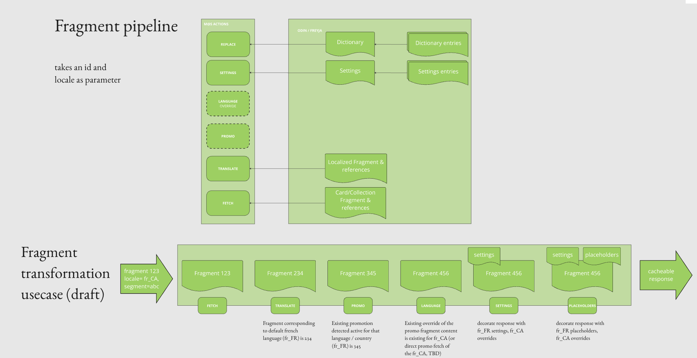
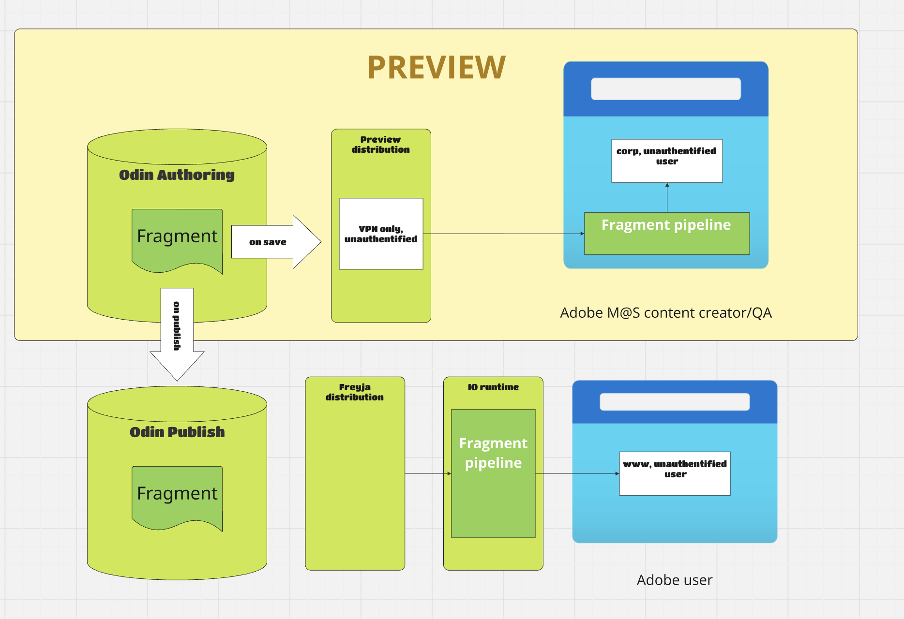

# fragment pipeline



this action sits behind mas/io/fragment in CDN and treats multiple odin related requests to provide m@s customers with :
- placeholders,
- settings,
- promotion,
- translation (we don't want surface to handle id mapping for each locale)

## preview



[fragment-client.js](../fragment-client.js) is built consistently with what is deployed in adobe io runtime with
```npm run build:client``` to reproduce that pipeline not in io runtime containers but on the browser.


